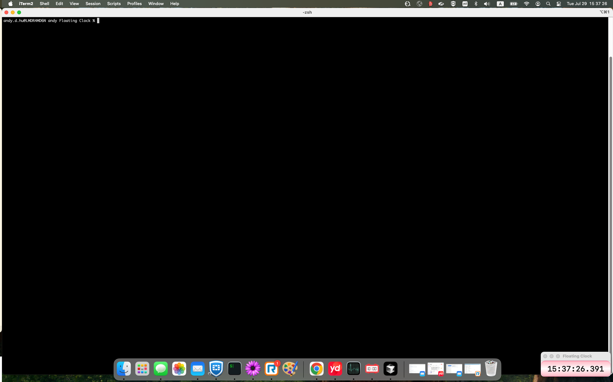

# Floating Clock

一个优雅的 macOS 浮动时钟应用，提供精确到毫秒的时间显示。

## 📦 下载

**已提供 DMG 安装包**: 项目包含 `FloatingClock_v1.0.dmg` 文件，可直接在 macOS x64 平台上使用，无需编译源码。

**💾 直接下载**: [点击下载 FloatingClock_v1.0.dmg](https://github.com/andyhu-hz/floatingclock/raw/main/FloatingClock_v1.0.dmg)

## 📸 应用预览

*（时钟窗口在桌面的右下角）*

## ✨ 功能特点

- **精确时间显示**: 24小时制时间显示，精确到毫秒
- **始终置顶**: 窗口始终保持在最前面，不会被其他应用遮挡
- **可拖拽移动**: 支持鼠标拖拽移动窗口位置
- **多种关闭方式**: 
  - 双击窗口关闭应用
  - 从 Dock 右键菜单关闭
  - 使用快捷键 `Cmd+Q`
- **防多实例**: 自动防止多个实例同时运行
- **智能定位**: 启动时自动显示在屏幕右下角
- **美观界面**: 粉色渐变背景，圆角设计，优雅阴影效果

## 🚀 安装说明

### 方法一：使用 DMG 安装包
1. 下载 `FloatingClock_v1.0.dmg` 文件
2. 双击打开 DMG 文件
3. 将 `FloatingClock.app` 拖拽到 `Applications` 文件夹
4. 从 `Applications` 文件夹启动 `FloatingClock`

### 方法二：从源码编译
1. 克隆项目到本地
2. 使用 Xcode 打开 `FloatingClock.xcodeproj`
3. 选择目标设备为 macOS
4. 点击运行按钮或使用 `Cmd+R` 编译运行

## 📱 使用方法

1. **启动应用**: 从 Applications 文件夹或 Dock 启动
2. **移动位置**: 用鼠标拖拽窗口到任意位置
3. **关闭应用**: 
   - 双击窗口
   - 右键 Dock 图标选择"退出 Floating Clock"
   - 使用快捷键 `Cmd+Q`

## 💻 系统要求

- **操作系统**: macOS 14.0 或更高版本
- **架构**: Intel 或 Apple Silicon (M1/M2/M3)
- **内存**: 最小 4GB RAM
- **存储**: 约 10MB 可用空间

## 🔧 技术特性

- **开发语言**: Swift + SwiftUI
- **时间精度**: 毫秒级显示 (每 0.033 秒更新)
- **窗口管理**: 自定义 NSWindow 实现浮动效果
- **性能优化**: 单例模式避免重复创建对象
- **内存管理**: 自动内存管理，无内存泄漏

## 🛠️ 故障排除

如果遇到问题，请检查：

1. **权限设置**: 
   - 打开"系统偏好设置 > 安全性与隐私"
   - 确保允许 FloatingClock 运行

2. **系统权限**: 
   - 检查是否授予必要的系统权限
   - 在"隐私与安全性"中允许应用访问

3. **应用冲突**: 
   - 确保没有其他实例在运行
   - 重启应用或重启系统

## 📝 开发信息

- **版本**: v1.0
- **开发者**: Andy Hu
- **许可证**: BSD 3-Clause License
- **项目地址**: https://github.com/andyhu-hz/floatingclock

## 🤝 贡献

欢迎提交 Issue 和 Pull Request 来改进这个项目！

## 📄 许可证

BSD 3-Clause License

Copyright (c) 2025, Andy Hu
All rights reserved.

Redistribution and use in source and binary forms, with or without
modification, are permitted provided that the following conditions are met:

1. Redistributions of source code must retain the above copyright notice, this
   list of conditions and the following disclaimer.

2. Redistributions in binary form must reproduce the above copyright notice,
   this list of conditions and the following disclaimer in the documentation
   and/or other materials provided with the distribution.

3. Neither the name of the copyright holder nor the names of its
   contributors may be used to endorse or promote products derived from
   this software without specific prior written permission.

THIS SOFTWARE IS PROVIDED BY THE COPYRIGHT HOLDERS AND CONTRIBUTORS "AS IS"
AND ANY EXPRESS OR IMPLIED WARRANTIES, INCLUDING, BUT NOT LIMITED TO, THE
IMPLIED WARRANTIES OF MERCHANTABILITY AND FITNESS FOR A PARTICULAR PURPOSE ARE
DISCLAIMED. IN NO EVENT SHALL THE COPYRIGHT HOLDER OR CONTRIBUTORS BE LIABLE
FOR ANY DIRECT, INDIRECT, INCIDENTAL, SPECIAL, EXEMPLARY, OR CONSEQUENTIAL
DAMAGES (INCLUDING, BUT NOT LIMITED TO, PROCUREMENT OF SUBSTITUTE GOODS OR
SERVICES; LOSS OF USE, DATA, OR PROFITS; OR BUSINESS INTERRUPTION) HOWEVER
CAUSED AND ON ANY THEORY OF LIABILITY, WHETHER IN CONTRACT, STRICT LIABILITY,
OR TORT (INCLUDING NEGLIGENCE OR OTHERWISE) ARISING IN ANY WAY OUT OF THE USE
OF THIS SOFTWARE, EVEN IF ADVISED OF THE POSSIBILITY OF SUCH DAMAGE.

---

**享受你的浮动时钟！** ⏰

---

# Floating Clock (English)

An elegant macOS floating clock application that provides millisecond-precise time display.

## 📦 Download

**DMG Package Available**: The project includes `FloatingClock_v1.0.dmg` file, ready to use on macOS x64 platform without compiling source code.

**💾 Direct Download**: [Click to download FloatingClock_v1.0.dmg](https://github.com/andyhu-hz/floatingclock/raw/main/FloatingClock_v1.0.dmg)

## 📸 Application Preview

*(Clock window located in the bottom-right corner of the desktop)*

## ✨ Features

- **Precise Time Display**: 24-hour format time display, accurate to milliseconds
- **Always on Top**: Window always stays in front, never blocked by other applications
- **Draggable**: Support mouse drag to move window position
- **Multiple Close Options**: 
  - Double-click window to close application
  - Close from Dock right-click menu
  - Use shortcut key `Cmd+Q`
- **Multi-instance Prevention**: Automatically prevents multiple instances from running
- **Smart Positioning**: Automatically appears in bottom-right corner on startup
- **Beautiful Interface**: Pink gradient background, rounded corners, elegant shadow effects

## 🚀 Installation Instructions

### Method 1: Using DMG Package

1. Download `FloatingClock_v1.0.dmg` file
2. Double-click to open the DMG file
3. Drag `FloatingClock.app` to `Applications` folder
4. Launch `FloatingClock` from `Applications` folder

### Method 2: Compile from Source

1. Clone the project locally
2. Open `FloatingClock.xcodeproj` with Xcode
3. Select macOS as target device
4. Click run button or use `Cmd+R` to compile and run

## 📱 Usage

1. **Launch Application**: Start from Applications folder or Dock
2. **Move Position**: Use mouse to drag window to any position
3. **Close Application**: 
   - Double-click window
   - Right-click Dock icon and select "Quit Floating Clock"
   - Use shortcut key `Cmd+Q`

## 💻 System Requirements

- **Operating System**: macOS 14.0 or higher
- **Architecture**: Intel or Apple Silicon (M1/M2/M3)
- **Memory**: Minimum 4GB RAM
- **Storage**: About 10MB available space

## 🔧 Technical Features

- **Development Language**: Swift + SwiftUI
- **Time Precision**: Millisecond display (updates every 0.033 seconds)
- **Window Management**: Custom NSWindow implementation for floating effect
- **Performance Optimization**: Singleton pattern to avoid repeated object creation
- **Memory Management**: Automatic memory management, no memory leaks

## 🛠️ Troubleshooting

If you encounter issues, please check:

1. **Permission Settings**: 
   - Open "System Preferences > Security & Privacy"
   - Ensure FloatingClock is allowed to run

2. **System Permissions**: 
   - Check if necessary system permissions are granted
   - Allow application access in "Privacy & Security"

3. **Application Conflicts**: 
   - Ensure no other instances are running
   - Restart application or restart system

## 📝 Development Information

- **Version**: v1.0
- **Developer**: Andy Hu
- **License**: BSD 3-Clause License
- **Project URL**: https://github.com/andyhu-hz/floatingclock

## 🤝 Contributing

Welcome to submit Issues and Pull Requests to improve this project!

## 📄 License

BSD 3-Clause License

Copyright (c) 2025, Andy Hu
All rights reserved.

Redistribution and use in source and binary forms, with or without
modification, are permitted provided that the following conditions are met:

1. Redistributions of source code must retain the above copyright notice, this
   list of conditions and the following disclaimer.

2. Redistributions in binary form must reproduce the above copyright notice,
   this list of conditions and the following disclaimer in the documentation
   and/or other materials provided with the distribution.

3. Neither the name of the copyright holder nor the names of its
   contributors may be used to endorse or promote products derived from
   this software without specific prior written permission.

THIS SOFTWARE IS PROVIDED BY THE COPYRIGHT HOLDERS AND CONTRIBUTORS "AS IS"
AND ANY EXPRESS OR IMPLIED WARRANTIES, INCLUDING, BUT NOT LIMITED TO, THE
IMPLIED WARRANTIES OF MERCHANTABILITY AND FITNESS FOR A PARTICULAR PURPOSE ARE
DISCLAIMED. IN NO EVENT SHALL THE COPYRIGHT HOLDER OR CONTRIBUTORS BE LIABLE
FOR ANY DIRECT, INDIRECT, INCIDENTAL, SPECIAL, EXEMPLARY, OR CONSEQUENTIAL
DAMAGES (INCLUDING, BUT NOT LIMITED TO, PROCUREMENT OF SUBSTITUTE GOODS OR
SERVICES; LOSS OF USE, DATA, OR PROFITS; OR BUSINESS INTERRUPTION) HOWEVER
CAUSED AND ON ANY THEORY OF LIABILITY, WHETHER IN CONTRACT, STRICT LIABILITY,
OR TORT (INCLUDING NEGLIGENCE OR OTHERWISE) ARISING IN ANY WAY OUT OF THE USE
OF THIS SOFTWARE, EVEN IF ADVISED OF THE POSSIBILITY OF SUCH DAMAGE.

---

**Enjoy your floating clock!** ⏰ 